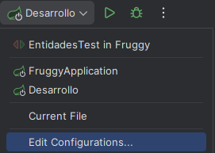

# Fruggy

Fruggy es una aplicación móvil que permite a los usuarios comparar precios de productos entre diferentes supermercados de forma rápida y sencilla. La aplicación tiene como objetivo ayudar a los consumidores a ahorrar dinero en sus compras diarias de comestibles.

<h3>Funcionalidades:</h3>

<b>Búsqueda de productos:</b> Los usuarios pueden buscar productos por nombre, marca o categoría.

<b>Comparación de precios:</b> La aplicación muestra los precios del producto seleccionado en diferentes supermercados cercanos al usuario.

<b>Listas de la compra:</b> Los usuarios pueden crear listas de la compra y ver el precio total de la lista en cada supermercado.

<b>Historial de precios:</b> La aplicación guarda el historial de precios de los productos para que los usuarios puedan ver cómo han cambiado los precios con el tiempo.

<b>Ofertas y promociones:</b> La aplicación muestra las ofertas y promociones actuales de los supermercados cercanos.

<b>Notificaciones:</b> Los usuarios pueden recibir notificaciones cuando un producto que les interesa baja de precio.

<h3>Beneficios:</h3>

<b>Ahorro de dinero:</b> Fruggy ayuda a los usuarios a ahorrar dinero en sus compras de comestibles al comparar precios entre diferentes supermercados.

<b>Comodidad:</b> La aplicación es fácil de usar y permite a los usuarios comparar precios desde la comodidad de su teléfono móvil.

<b>Tiempo:</b> Fruggy ahorra tiempo a los usuarios al eliminar la necesidad de visitar diferentes supermercados para comparar precios.

<b>Información:</b> La aplicación proporciona a los usuarios información valiosa sobre los precios de los productos, lo que les ayuda a tomar decisiones informadas sobre sus compras.

<h3>Público objetivo:</h3>

Fruggy está dirigida a consumidores que buscan ahorrar dinero en sus compras de comestibles. La aplicación es especialmente útil para familias, estudiantes y personas con un presupuesto limitado.

<h3>Modelo de negocio:</h3>

Fruggy se puede monetizar de varias maneras, como por ejemplo:

<b>Publicidad:</b> La aplicación puede mostrar anuncios de supermercados y otras empresas relacionadas.

<b>Suscripciones:</b> Los usuarios pueden pagar una suscripción mensual o anual para acceder a funciones premium, como la posibilidad de comparar precios de un mayor número de supermercados o de recibir notificaciones personalizadas.

<h3>Conclusión:</h3>

Fruggy es una aplicación móvil innovadora que tiene el potencial de ayudar a los consumidores a ahorrar dinero en sus compras de comestibles. La aplicación es fácil de usar, ofrece una valiosa información y tiene un gran mercado objetivo. Con un modelo de negocio sólido, Fruggy tiene el potencial de convertirse en una empresa exitosa.

# INSTALACIÓN

Para proceder a la instalación y ejecución de la aplicación, debemos seguir los siguientes pasos

    - Instalar Docker
    - Ejecutar el comando que hay en el archivo 'docker-run.txt' para crear el contenedor de base de datos del proyecto

# EJECUCIÓN

    - Arrancar el proyecto en el perfil de ejecución "desarrollo" activada
    - Entrar a http://localhost:8080/ con un navegador 
 